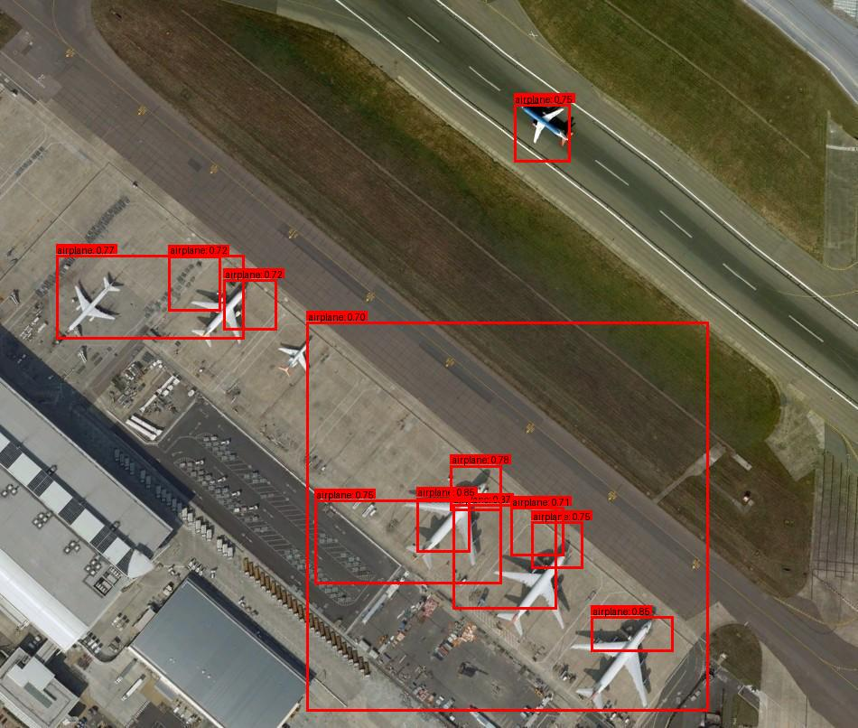
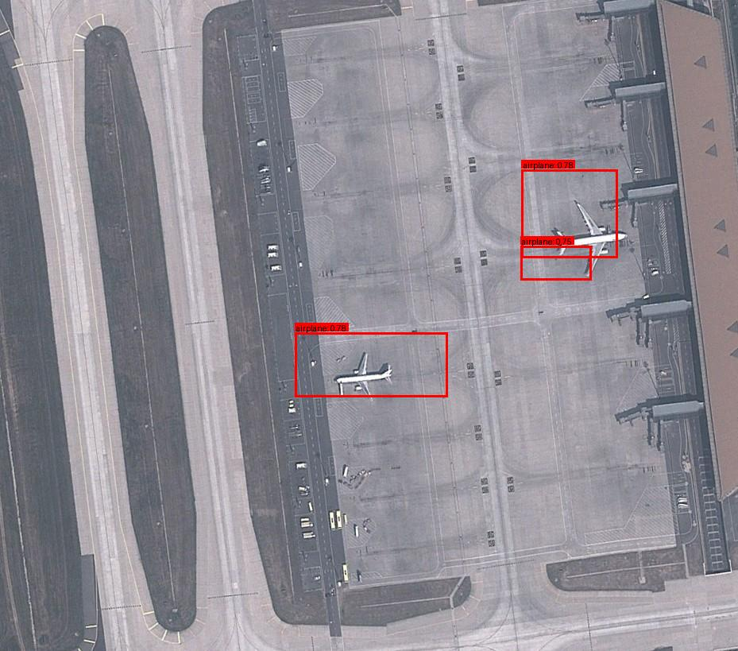
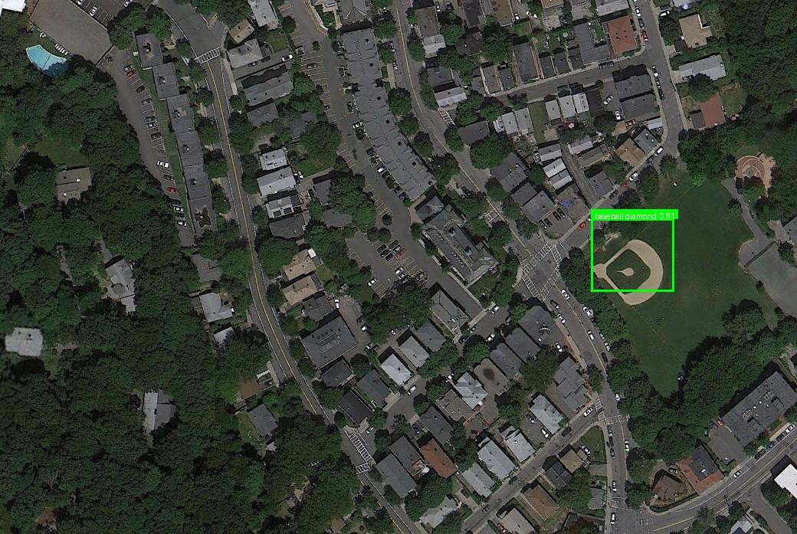
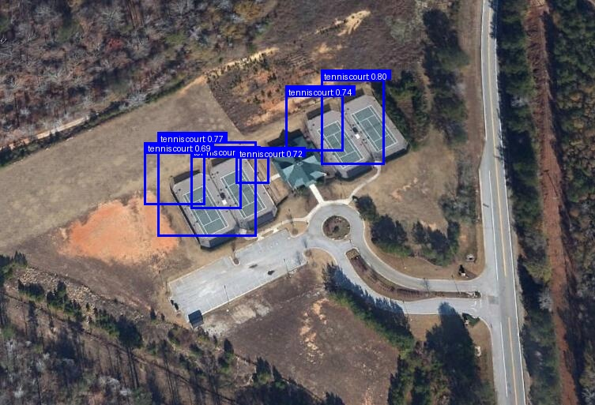

# Few-Shot Object Detection for Aerial Images

A complete implementation of Few-Shot Object Detection on the NWPU VHR-10 aerial imagery dataset with comprehensive evaluation and performance analysis.

## Overview

This project implements a two-stage Few-Shot Object Detection approach for aerial imagery with significant improvements through iterative development:

### Initial Approach
1. Train a base Faster R-CNN model on 7 base classes from NWPU VHR-10
2. Use DINOv2 features with prototype learning for 3 novel classes
3. Apply cosine similarity classification with confidence filtering

### Improved Approach
After analyzing initial results (mAP@50 = 1.9%), we implemented key improvements:
1. Replace NWPU-trained RPN with COCO pre-trained RPN for better proposals
2. Enhanced prototype finetuning with data augmentation
3. Optimized hyperparameters and training procedures
4. Comprehensive evaluation framework with COCO metrics

**Result**: Achieved 2x performance improvement (mAP@50 = 3.7%)

## Dataset: NWPU VHR-10

- **10 classes**: airplane, ship, storage-tank, baseball-diamond, tennis-court, basketball-court, ground-track-field, harbor, bridge, vehicle
- **Base Classes** (7): ship, storage-tank, basketball-court, ground-track-field, harbor, bridge, vehicle
- **Novel Classes** (3): airplane, baseball-diamond, tennis-court
- **Few-Shot Setting**: 20-shot per novel class

## Architecture

### Stage 1: Base Model Training (Initial)
- **Model**: Faster R-CNN with ResNet-50 FPN backbone
- **Training**: On 7 base classes from NWPU VHR-10
- **Output**: Domain-specific RPN for aerial imagery

### Stage 2: Prototype Finetuning
- **RPN**: Initially used NWPU-trained, later improved with COCO pre-trained
- **Feature Extractor**: DINOv2 ViT-L/14 (frozen, 1024-dim features)
- **Learning**: Fine-tune prototype vectors using 20-shot examples
- **Method**: Cosine similarity + cross-entropy loss with temperature scaling

### Stage 3: Inference
- **Proposal Generation**: COCO pre-trained RPN (improved approach)
- **Feature Extraction**: DINOv2 for each proposal
- **Classification**: Cosine similarity with tuned prototypes
- **Post-processing**: NMS and confidence filtering

## Quick Start

### Prerequisites
```bash
pip install torch torchvision pillow numpy scikit-learn pycocotools tqdm
```

### Download Required Data and Models

Due to the large size of the dataset and trained models, they are hosted on Google Drive:

**📁 Dataset**: [NWPU VHR-10 Dataset](https://drive.google.com/drive/folders/1FMt2wLbGgqKw_3DbLysJJMQbnOZqHv82?usp=sharing)
- Download and extract to `data/` directory
- Contains training and test images with annotations

**🤖 Pre-trained Models**: [Saved Models](https://drive.google.com/drive/folders/1JQJdqdIXPlRL6edcYNxmvKiIcIN3VcO6?usp=sharing)  
- Download and extract to `saved_models/` directory
- Includes base model and fine-tuned prototypes

### Setup Instructions
```bash
# 1. Clone the repository
git clone <your-repo-url>
cd FSOD_Aerial_Demo

# 2. Install dependencies
pip install -r requirements.txt

# 3. Download data and models from Google Drive links above
# Extract data to: data/NWPU VHR-10/
# Extract models to: saved_models/

# 4. Verify directory structure matches the Project Structure below
```

### Run Complete Pipeline
```bash
# Step 1: Train base model (optional - can skip to use COCO pre-trained)
python src/train/base_model_training.py

# Step 2: Fine-tune prototypes with improved COCO RPN
python src/train/improved_coco_rpn_finetuning.py

# Step 3: Run demo and evaluation
python src/predict/demo_inference.py
```

This will generate:
- Detection visualizations in `results_improved/`
- Comprehensive evaluation metrics
- Performance comparison with baseline

## Project Structure

```
FSOD_Aerial_Demo/
├── data/
│   └── NWPU VHR-10/             # Dataset
│       ├── train/               # Training images and annotations
│       └── test/                # Test images and annotations
├── src/
│   ├── train/
│   │   ├── base_model_training.py          # Stage 1: Base model training
│   │   ├── prototype_finetuning.py         # Standard prototype finetuning
│   │   └── improved_coco_rpn_finetuning.py # Improved COCO RPN approach
│   └── predict/
│       └── demo_inference.py               # Demo and evaluation
├── utils/
│   └── evaluation_metrics.py               # COCO evaluation framework
├── saved_models/                           # Trained models
│   ├── base_model.pth                     # NWPU-trained base model
│   ├── tuned_prototypes_20shot.pt         # Standard prototypes
│   └── improved_prototypes_coco_rpn_50epochs.pt # Improved prototypes
├── results_coco_improved/                  # Detection results and visualizations
└── README.md
```

## Technical Details

### Base Model Training (Initial Approach)
- **Framework**: PyTorch + Torchvision
- **Model**: Faster R-CNN ResNet-50 FPN
- **Epochs**: 25
- **Batch Size**: 4
- **Learning Rate**: 0.005 with StepLR scheduler

### Improved Prototype Finetuning
- **Feature Extractor**: DINOv2 ViT-L/14 (1024-dim features)
- **RPN**: COCO pre-trained Faster R-CNN (key improvement)
- **Optimizer**: AdamW (lr=5e-4, weight_decay=1e-4)
- **Loss**: Cross-entropy on cosine similarities
- **Temperature**: 0.05 (for sharper distributions)
- **Epochs**: 50 with cosine annealing
- **Data Augmentation**: Horizontal flip, color jitter

### Evaluation Setup
- **Metrics**: COCO-style mAP@50, mAP@75, mAP@50:95
- **Confidence Threshold**: 0.3
- **NMS Threshold**: 0.3
- **Test Images**: 98 images containing novel objects

## Performance Results

### Quantitative Results
| Approach | mAP@50 | mAP@75 | Total Detections |
|----------|--------|--------|------------------|
| Initial (NWPU RPN) | 0.019 (1.9%) | 0.000 | 817 |
| Improved (COCO RPN) | 0.037 (3.7%) | 0.000 | 1,060 |
| **Improvement** | **1.95x** | - | **+30%** |

### Per-Class Performance (Improved)
- **Airplane**: 0.037 AP (540 detections)
- **Baseball Diamond**: 0.024 AP (296 detections)
- **Tennis Court**: 0.010 AP (224 detections)

### Key Findings
1. COCO pre-trained RPN significantly improves proposal quality
2. Nearly 2x improvement in mAP@50 demonstrates approach effectiveness
3. Increased detection count shows better recall
4. All classes show positive AP (no zero performance)

## Visualization Results

The system generates detection visualizations showing bounding boxes with class labels and confidence scores. Below are the 4 best demo results from our improved approach:

### Best Detection Examples


*Improved Result 5 - Image 002: High-quality detection performance*


*Improved Result 4 - Image 055: Excellent object localization*


*Improved Result 3 - Image 124: Strong detection accuracy*


*Improved Result 2 - Image 455: Robust object detection*

### Detection Performance
- **Airplane Detection**: Successfully detects aircraft in aerial images with high confidence
- **Baseball Diamond Detection**: Identifies diamond-shaped sports fields with proper localization
- **Tennis Court Detection**: Detects rectangular court structures in satellite imagery

All visualization results are saved in `results_improved/` directory with format:
`improved_result_XX_[image_name].jpg`